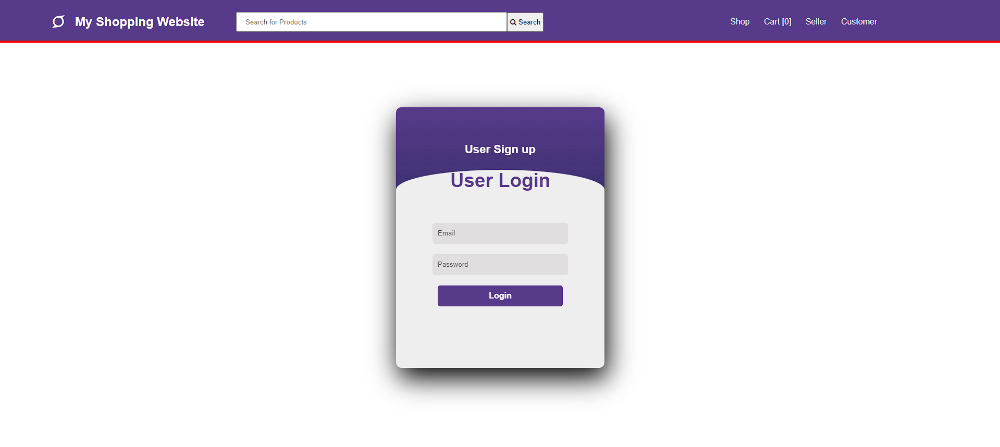
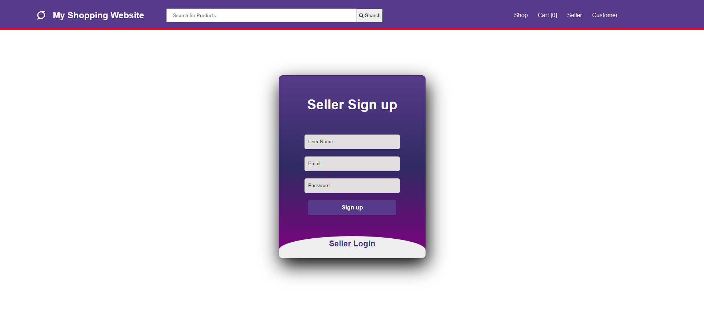
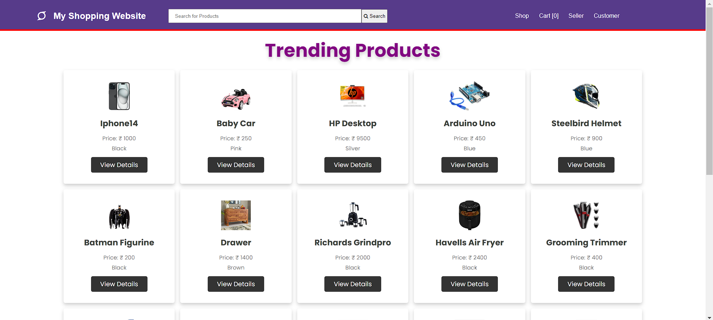

# My Shopping Website
This project was generated with [Angular CLI](https://github.com/angular/angular-cli) version 17.1.2.

## Development server

Run `ng serve` for a dev server. Navigate to `http://localhost:4200/`. The application will automatically reload if you change any of the source files.

<h2>Customer Login page</h2>

<h2>Seller Signup page</h2>

<h2>Shopping page</h2>

